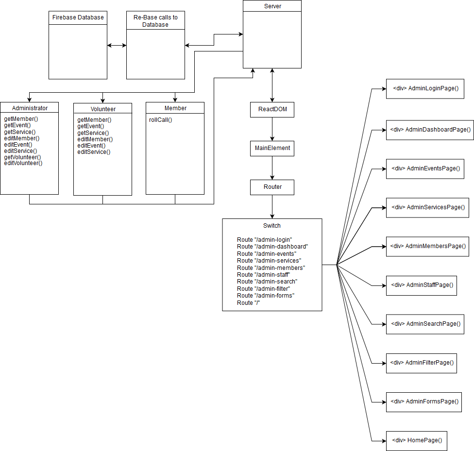

# Developer Documentation

## Quick Links

* [Reporting Issues](#Reporting-Issues)
* [Contacting Developers](#Contacting-Developers)
* [Contributing](#Contributing)

Table of Contents

* [Developer Documentation](#developer-documentation)
  * [Quick Links](#quick-links)
  * [Reporting Issues or Bugs](#reporting-issues-or-bugs)
  * [Contacting Developers](#contacting-developers)
  * [Contributing](#contributing)
    * [Obtaining and Building Source Code](#obtaining-and-building-source-code)
    * [Contributing to Live Development](#contributing-to-live-development)
  * [Class Diagram](#class-diagram)
  * [Versions](#versions)
    * [Latest Stable Versions](#latest-stable-versions)
    * [Development Versions](#development-versions)
    * [Continuing Development on End of Life (EOL) Versions](#continuing-development-on-end-of-life-eol-versions)
  * [Directory Structure](#directory-structure)
  * [How to Test the Software](#how-to-test-the-software)
  * [How to Release the Software](#how-to-release-the-software)
  * [Database](#database)
  * [Design](#design)
    * [Routing](#routing)
    * [Pages](#pages)

## Reporting Issues or Bugs

---
To report an issue with Bindex.tk, on our [github](https://github.com/ESOF-423/FireBindex) page, please create an issue with as much detail about the issue as possible including your authorization status, the version you are using, and any other relevant information.

## Contacting Developers

---
Developers can be contacted through email:
<bindexdevelopers@gmail.com>


## Obtaining and Building Source Code

All source code is hosted on GitHub @ <https://github.com/ESOF-423/FireBindex>

Bindex is an open-source project written for a software engineering class at Montana State University by students.

1. Make sure you have [Node](https://nodejs.org/en/download/) and [npm](https://docs.npmjs.com/cli/install) installed on your machine. To check if you have them, run `node -v` or `npm -v` to check the version you are running.
2. In a terminal, run `git clone https://github.com/ESOF-423/BindexTK.git`
   * Optionally, checkout a branch to test pre-release features
3. run `npm install`
4. run `npm start`

## Contributing to Live Development

Thank you for your interest contributing to Bindex! Please observe the following process to ensure that your changes are easy to integrate into the service.

  1. Fork the [repository](https://github.com/ESOF-423/FireBindex)
  2. Clone your fork

     `git clone https://github.com/yourusername/Bindex.git`

  3. Add the [repository](https://github.com/ESOF-423/FireBindex) as an upstream remote

     `git remote add upstream https://github.com/ESOF-423/BindexTK.git`

  4. Confirm the remote was successfully added

     `git remote -v`

  5. Checkout the `dev` branch

     `git checkout -t upstream/dev`

  6. Create a new branch for the feature you would like to add

     `git checkout -b myfeaturebranch`

  7. Implement your feature 
  
  8. Submit a pull request onto the `dev` branch of the [repository](https://github.com/ESOF-423/BindexTK)

## Class Diagram



## Versions

### Latest Stable Versions

Current stable releases are hosted at [bindex.tk](http://bindex.tk)
Source code for stable releases can be found on our [GitHub](https://github.com/ESOF-423/BindexTK)

### Development Versions

Development Versions are done on the [dev branch](<https://github.com/ESOF-423/BindexTK/tree/dev>) in the GitHub repository. Versions of code that are currently being tested for their potential to be released can be found here.
We do not host live versions of development code. To test these features, please download the source code using the instructions above

### Continuing Development on End of Life (EOL) Versions

> For Developers seeking to continue Bindex after its original developers have stopped supporting new versions.

All software comes to an end; whether code is developed into a final version or developers stop mid-release. Bindex is an open source project, and therefore available to anyone who wants to continue its development. [Email](bindexdevelopers@gmail.com) us and ask us about spear-heading the future continuation of Bindex through your own releases.

## Directory Structure

* [/Documentation](<https://github.com/ESOF-423/BindexTK/tree/master/Documentation>) contains documentation for both users and developers
* [/src/tests](<https://github.com/ESOF-423/BindexTK/tree/master/src/tests>) contains test cases for both Node and Python
* [/src](<https://github.com/ESOF-423/BindexTK/tree/master/src>) contains the project JavaScript
* [/public](https://github.com/ESOF-423/BindexTK/tree/master/public) contains project assets not added as a Node module

## How to Test the Software

Something w/ Travis.. I heard he's a cool dude (or gal)

## How to Release the Software

Please [contact us](bindexdevelopers@gmail.com) for information regarding deploying Bindex.tx 

## Database

We are using Firebase's Realtime Databse with the following structure: 

```
belgradeseniorcenter
.
|-- attendance
|   |-- uid
|       |-- event_id
|       |-- member_id
|-- events
|   |-- uid
|       |-- eventDescription
|       |-- eventEndDate
|       |-- eventEndTime
|       |-- eventName
|       |-- eventStartDate
|       |-- eventStartTime
|-- members
|   |-- uid
|       |-- apartmentNumber
|       |-- birthday
|       |-- city
|       |-- email
|       |-- emergencyFirstName
|       |-- emergencyLastName
|       |-- emergencyPhoneNumber
|       |-- emergencyRelationship
|       |-- firstname
|       |-- lastName
|       |-- meals
|       |-- middleName
|       |-- phoneNumber
|       |-- state
|       |-- streetAddress
|       |-- zip
|-- services
|   |-- uid
|       |-- serviceDescription
|       |-- serviceEndDate
|       |-- serviceEndTime
|       |-- serviceName
|       |-- serviceStartDate
|       |-- serviceStartTime
|-- users
    |-- uid
        |-- email
        |-- username
```
## Design

Our app is very simple. We created it with the [create-react-app](https://facebook.github.io/create-react-app/) npm library and [this](https://www.robinwieruch.de/complete-firebase-authentication-react-tutorial/) tutorial

### Routing

Our routing is very simple using the React Router from react-router-dom

### Pages

Our design consists of the following pages:

* Account
* Admin
* Event
* Home
* Member
* MemberCheckIn
* PasswordForget
* Service
* SignIn
* SignUp

Pages are treated as components made up of more specific components that can be reused from page to page.
